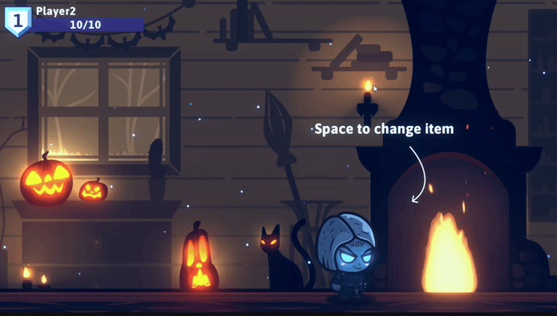
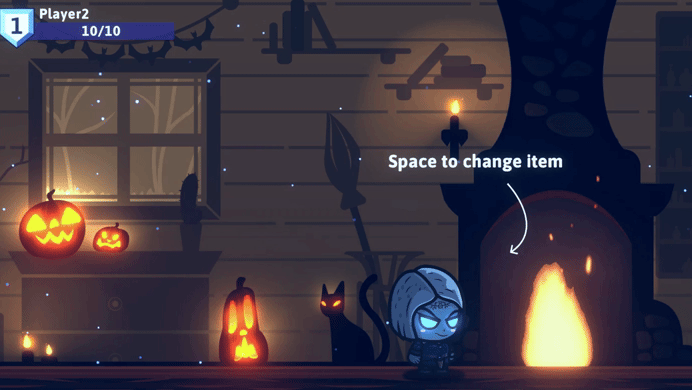
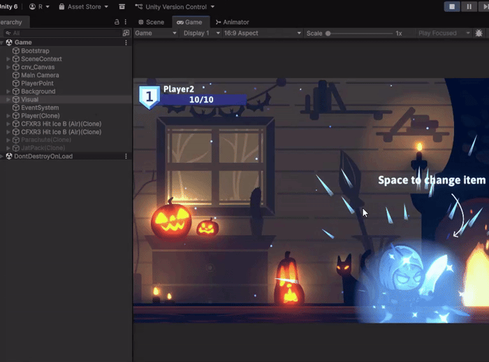
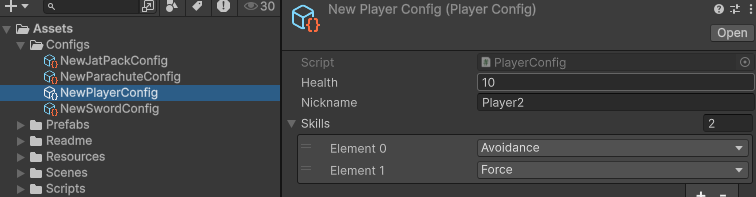

# Реализация системы инвентаря

Данный проект является тестовым заданием.

## Задание

Реализовать простые механики инвентаря:

- Показ текущего предмета в руки.
- Переключение предметов в руке по очереди.
- Необходимо использовать zenject для определения зависмостей по проекту.
- Необходимо соблюдать принципы SOLID в процессе разработки.
- Код должен быть читабельным и расширяемым.
- Показать код в действии.

---

[Скачать билд с Google Drive](https://drive.google.com/drive/folders/1WgSrKprITnC1iwTB_ik0IBEA7tbDbWF6?usp=sharing)

---

## На что следует обратить внимание:
#### Неплохой визуал, добавлены анимации, освещение, небольшие тени, чуть-чуть эффектов и кончено же пост-процессинг: 

  

#### Переключение предметов и установка их в логичные части игрока: 

  

#### В качестве небольшой оптимизации эффектов был реализован полноценный пул объектов: 

  

#### Настройка игрока и его предметов при помощи конфигов: 

  

### Используемые технологии

  
  
  
  
  
  
  

